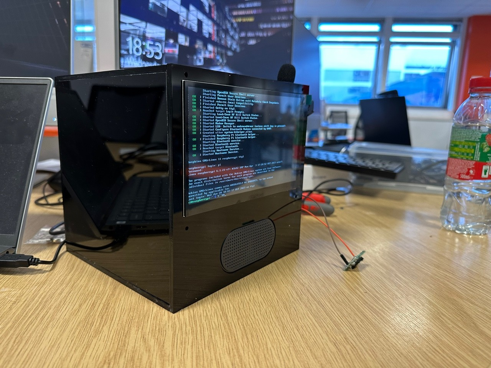

# AI-PET-NOVA
Watson IBM collaboration with Imperial College London
Designed an AI Pet named NOVA in collaboration with IBM company.

## Overview - Leaflet Design

## Flowchart

## Screen Designs

## Hardware Frame

## Poster

