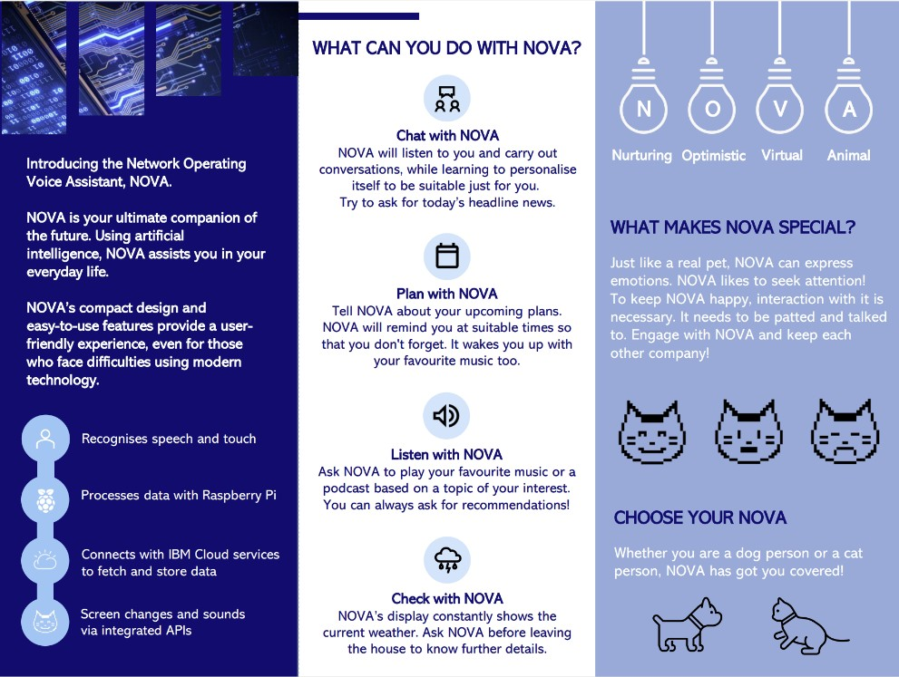
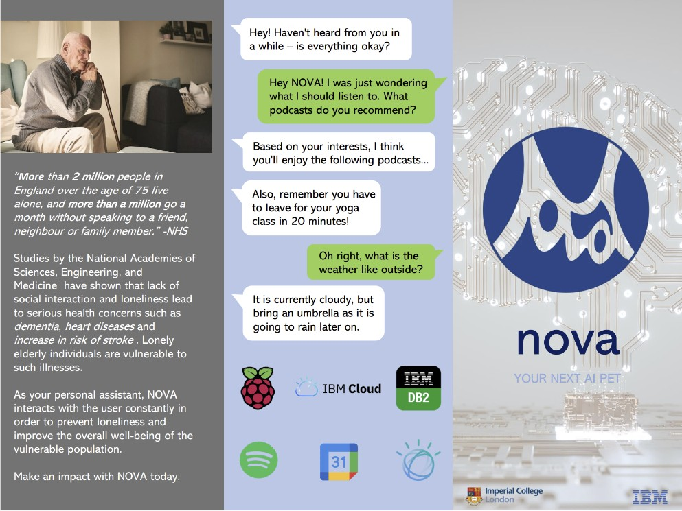
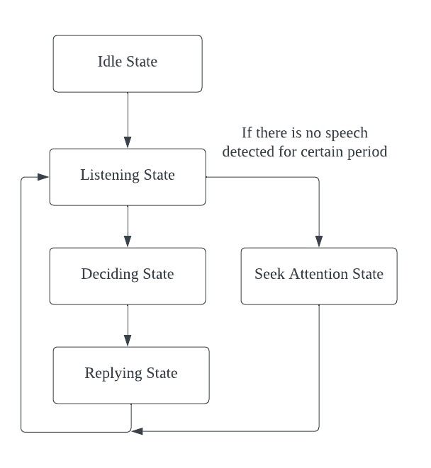
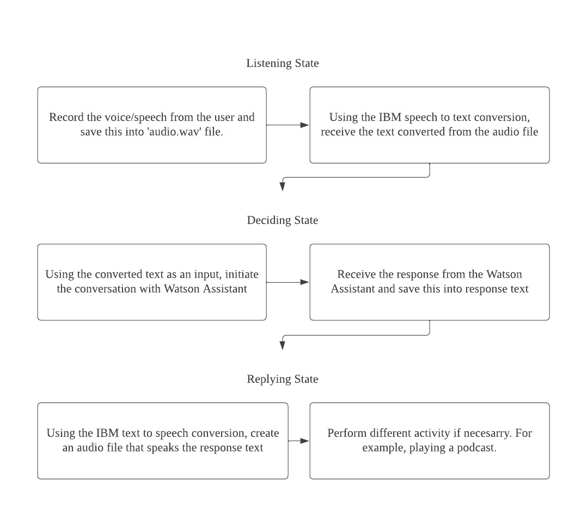
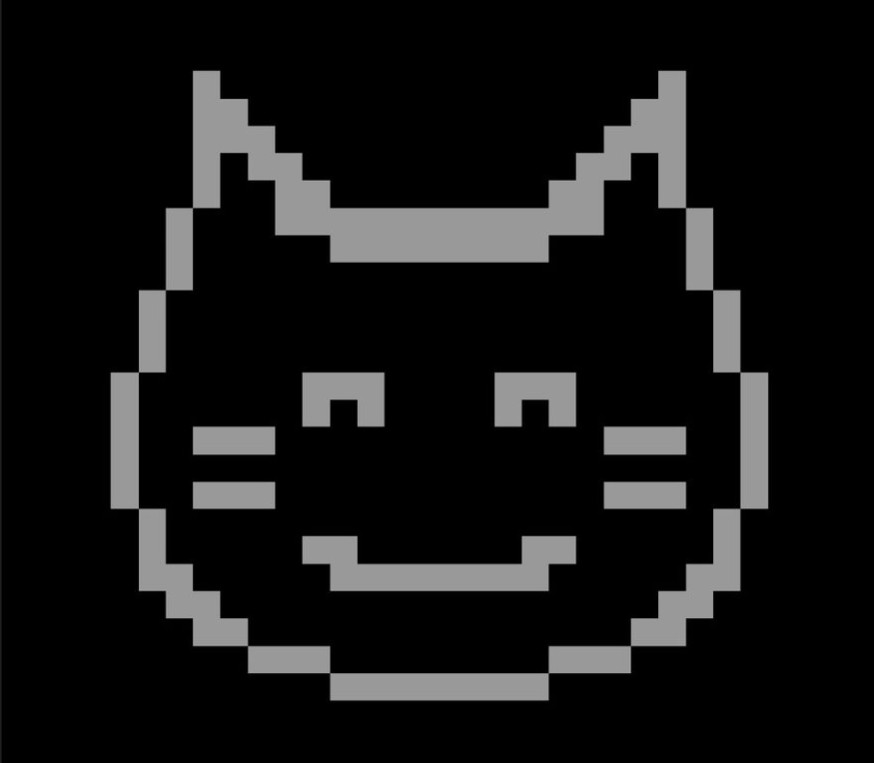
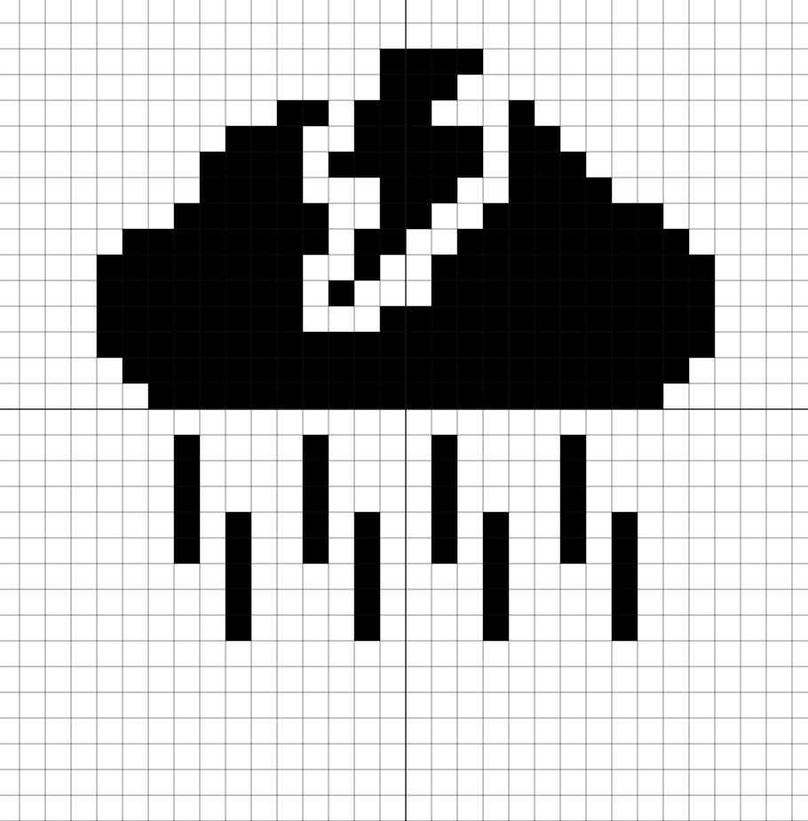
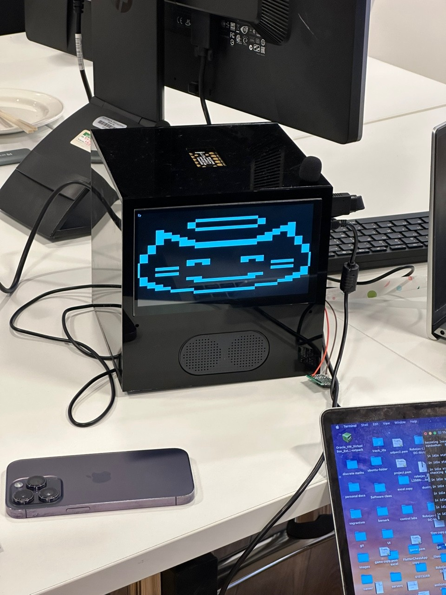
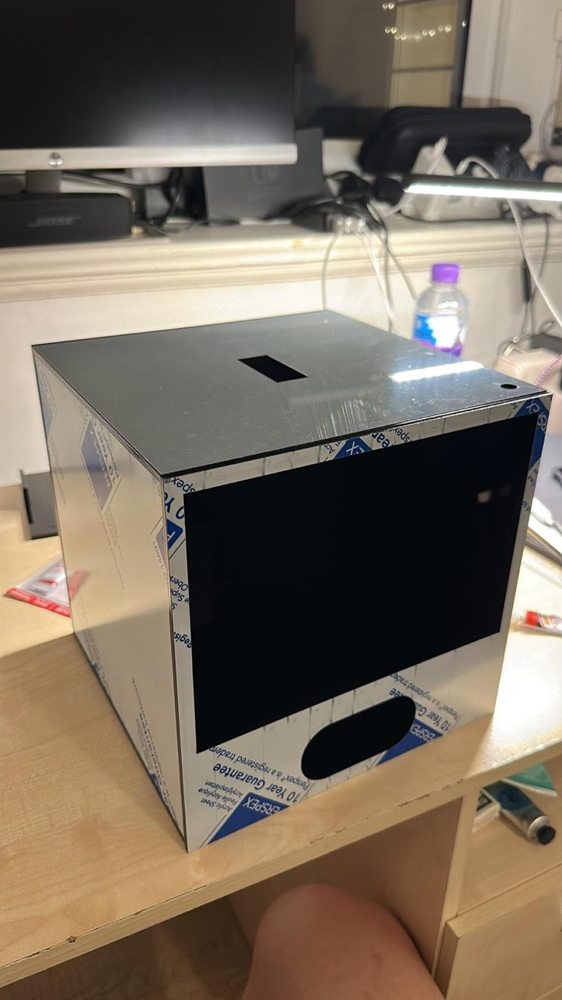
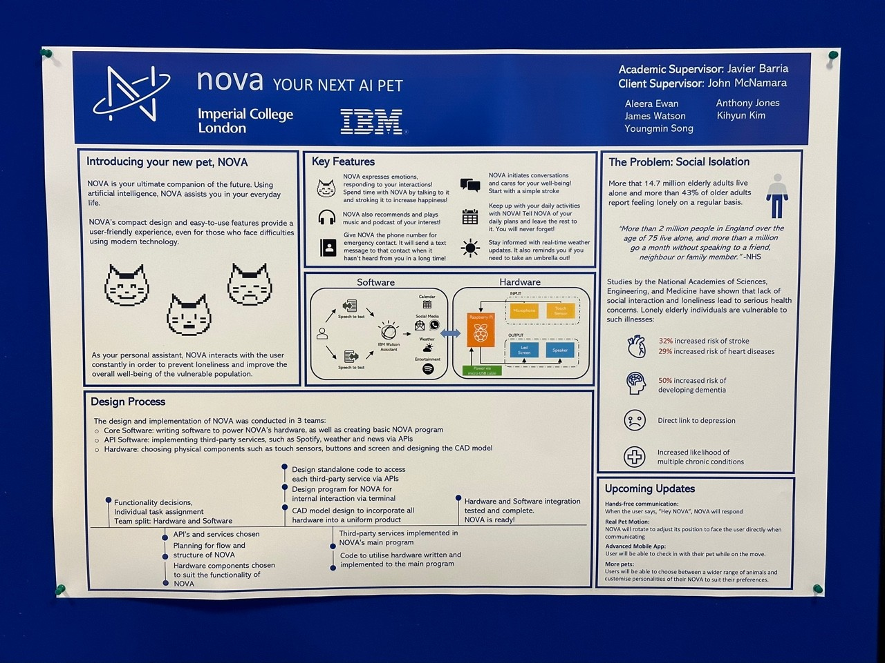

# AI-PET-NOVA
Watson IBM collaboration with Imperial College London

Designed an AI Pet named NOVA in collaboration with IBM company.

## Overview - Leaflet Design

  
  

## Flowchart

  
  

## Screen Designs

  
  

## Hardware Frame

  
  

  
   
  <em>The final appearance of NOVA on the presentation day</em>

## Poster

  
   
  <em>The poster of NOVA on the presentation day</em>

